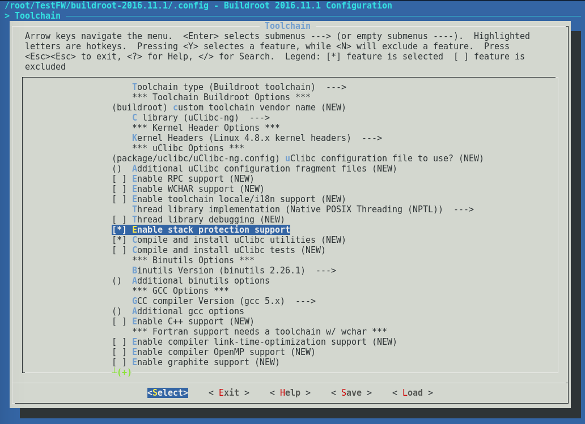

# 嵌入式安全最佳实践-1缓冲区及栈溢出保护

> 原文：[Buffer and Stack Overflow Protection](https://scriptingxss.gitbook.io/embedded-appsec-best-practices/1_buffer_and_stack_overflow_protection) 
>
> 作者：[Aaron Guzman](https://www.linkedin.com/in/scriptingxss/) [@scriptingxss](https://twitter.com/scriptingxss)
>
> 译者：[Shiro](https://blog.ffxiv.cat)
>
> 笔者能力不足水平有限，翻译不准确、遗漏、疏忽的地方请发送邮件或评论留言指出。


在固件中应避免使用公开的危险函数以防止内存损坏漏洞。

例：使用[不安全的C语言函数](https://www.securecoding.cert.org/confluence/display/c/VOID+MSC34-C.+Do+not+use+deprecated+and+obsolete+functions) - [strcat, strcpy, sprintf, scanf](http://cwe.mitre.org/data/definitions/676.html#Demonstrative%20Examples%29%29%20). 

内存损坏漏洞如缓冲区溢出，包含有[栈溢出](https://en.wikipedia.org/wiki/Stack_buffer_overflow%29\)和[堆溢出](https://en.wikipedia.org/wiki/Heap_overflow%29\)，简单起见，本文不区分这两种类型的漏洞。当攻击者挖出缓冲区溢出漏洞并成功利用后，受害者的PC指针寄存器会被覆写用以执行攻击者发送的恶意代码。


### 在源码中找出存在漏洞的函数 

**示例：**

**使用“Find”命令在源码中查找“strncpy” “strlen”之类有缺陷的函数**

```text
find . -type f -name '*.c' -print0|xargs -0 grep -e 'strncpy.*strlen'|wc -l
```

**使用grep的正则表达式**

```text
$ grep -E '(strcpy|strcat|strncat|sprintf|strlen|memcpy|fopen|gets)' fuzzgoat.c
   memcpy (&state.settings, settings, sizeof (json_settings));
            {  sprintf (error, "Unexpected EOF in string (at %d:%d)", line_and_col);
                        sprintf (error, "Invalid character value `%c` (at %d:%d)", b, line_and_col);
                            sprintf (error, "Invalid character value `%c` (at %d:%d)", b, line_and_col);
                  {  sprintf (error, "%d:%d: Unexpected EOF in block comment", line_and_col);
               {  sprintf (error, "%d:%d: Comment not allowed here", line_and_col);
               {  sprintf (error, "%d:%d: EOF unexpected", line_and_col);
                     sprintf (error, "%d:%d: Unexpected `%c` in comment opening sequence", line_and_col, b);
                  sprintf (error, "%d:%d: Trailing garbage: `%c`",
                  {  sprintf (error, "%d:%d: Unexpected ]", line_and_col);
                        sprintf (error, "%d:%d: Expected , before %c",
                        sprintf (error, "%d:%d: Expected : before %c",
                        {  sprintf (error, "%d:%d: Unexpected %c when seeking value", line_and_col, b);
                     {  sprintf (error, "%d:%d: Expected , before \"", line_and_col);
                     sprintf (error, "%d:%d: Unexpected `%c` in object", line_and_col, b);
                        {  sprintf (error, "%d:%d: Unexpected `0` before `%c`", line_and_col, b);
                  {  sprintf (error, "%d:%d: Expected digit before `.`", line_and_col);
                     {  sprintf (error, "%d:%d: Expected digit after `.`", line_and_col);
                  {  sprintf (error, "%d:%d: Expected digit after `e`", line_and_col);
   sprintf (error, "%d:%d: Unknown value", line_and_col);
   strcpy (error, "Memory allocation failure");
   sprintf (error, "%d:%d: Too long (caught overflow)", line_and_col);
         strcpy (error_buf, error);
         strcpy (error_buf, "Unknown error");
```

**使用Flawfinder工具进行代码审计**

```text
$ flawfinder fuzzgoat.c 
Flawfinder version 1.31, (C) 2001-2014 David A. Wheeler.
Number of rules (primarily dangerous function names) in C/C++ ruleset: 169
Examining fuzzgoat.c

FINAL RESULTS:

fuzzgoat.c:1049:  [4] (buffer) strcpy:
  Does not check for buffer overflows when copying to destination (CWE-120).
  Consider using strcpy_s, strncpy, or strlcpy (warning, strncpy is easily
  misused).
fuzzgoat.c:368:  [2] (buffer) memcpy:
  Does not check for buffer overflows when copying to destination (CWE-120).
  Make sure destination can always hold the source data.
fuzzgoat.c:401:  [2] (buffer) sprintf:
  Does not check for buffer overflows (CWE-120). Use sprintf_s, snprintf, or
  vsnprintf. Risk is low because the source has a constant maximum length.
<SNIP>
fuzzgoat.c:1036:  [2] (buffer) strcpy:
  Does not check for buffer overflows when copying to destination (CWE-120).
  Consider using strcpy_s, strncpy, or strlcpy (warning, strncpy is easily
  misused). Risk is low because the source is a constant string.
fuzzgoat.c:1041:  [2] (buffer) sprintf:
  Does not check for buffer overflows (CWE-120). Use sprintf_s, snprintf, or
  vsnprintf. Risk is low because the source has a constant maximum length.
fuzzgoat.c:1051:  [2] (buffer) strcpy:
  Does not check for buffer overflows when copying to destination (CWE-120).
  Consider using strcpy_s, strncpy, or strlcpy (warning, strncpy is easily
  misused). Risk is low because the source is a constant string.
ANALYSIS SUMMARY:

Hits = 24
Lines analyzed = 1082 in approximately 0.02 seconds (59316 lines/second)
Physical Source Lines of Code (SLOC) = 765
Hits@level = [0]   0 [1]   0 [2]  23 [3]   0 [4]   1 [5]   0
Hits@level+ = [0+]  24 [1+]  24 [2+]  24 [3+]   1 [4+]   1 [5+]   0
Hits/KSLOC@level+ = [0+] 31.3725 [1+] 31.3725 [2+] 31.3725 [3+] 1.30719 [4+] 1.30719 [5+]   0
Minimum risk level = 1
Not every hit is necessarily a security vulnerability.
There may be other security vulnerabilities; review your code!
See 'Secure Programming for Linux and Unix HOWTO'
(http://www.dwheeler.com/secure-programs) for more information.
```


### 使用不安全的函数  

[**不安全代码示例**](https://www.securecoding.cert.org/confluence/display/c/VOID+STR35-C.+Do+not+copy+data+from+an+unbounded+source+to+a+fixed-length+array): 下图的代码预设了gets()函数最多会从stdin读取(BUFSIZ-1)个字符。而实际操作中该预设并无约束，且可能会导致缓冲区溢出。要注意的是，BUFSIZ是一个在stdio.h中定义的常量，其仅表示setvbuf\(\)的建议值，并不代表输入缓冲区的最大值。

gets(\)函数作用为 将stdin中的字符读取到目标数组中，当遇到EOF或换行符时结束读取，删掉换行符，并在数组的末尾追加一个空字符。

```c
#include <stdio.h>

void func(void) {
  char buf[BUFSIZ];
  if (gets(buf) == NULL) {
    /* Handle error */
  }
}
```

**合规代码示例**: 

下面的代码中 fgets\(\) 最多只能从stdin中读取(BUFFERSIZE-1)个字符，读进缓冲区的字节不会超过给它分配的大小，因此这个方案安全、合规。

```c
#include <stdio.h>
#include <string.h>

enum { BUFFERSIZE = 32 };

void func(void) {
  char buf[BUFFERSIZE];
  int ch;

  if (fgets(buf, sizeof(buf), stdin)) {
    /* fgets succeeds; scan for newline character */
    char *p = strchr(buf, '\n');
    if (p) {
      *p = '\0';
    } else {
      /* Newline not found; flush stdin to end of line */
      while (((ch = getchar()) != '\n')
            && !feof(stdin)
            && !ferror(stdin))
        ;
    }
  } else {
    /* fgets failed; handle error */
  }
}
```


strncat\(\) 是库函数strcat()的一个变种。两者均用来拼接字符串。原函数strcat()的危险点在于调用方可能会传入一个大于接收缓冲区的数据导致溢出。一般情况的后果是出现段错误，严重的后果则可能破坏缓冲区之后的内存undetected and silent

strncat\(\) 追加了一个额外参数用于指定要复制的最大字节数，注意这个数**不是要复制的字节数**，也**不是源字符串的字符数**。这个参数应当设置为接收缓冲区的最大值。


**strncat()的正确用法:**

```c
char buffer[SOME_SIZE];

strncat( buffer, SOME_DATA, sizeof(buffer)-1);
```

**strncat()的错误用法**”**:**

```c
strncat( buffer, SOME_DATA, strlen( SOME_DATA ));
```


下面的截图演示了如何在用buildroot构建固件镜像时开启堆栈保护



**注意事项:**

* 使用哪种缓冲区？它的物理地址、逻辑地址、虚拟内存地址分别是多少？
* 缓冲区释放或从缓存淘汰后，该地址上残余的数据是什么？
* 如何保证原有的缓冲区不会泄露数据？（比如使用后清零？）
* 分配缓冲区时要初始化成特定值
* 设计在何处放置变量：放置在栈上？静态区域？或者动态分配？
* 
* What kind of buffer and where it resides: physical, logical, virtual memory?
* What data will remain when the buffer is freed or left around to LRU out?
* What strategy will be followed to ensure old buffers do not leak data \(example: clear buffer after use\)?
* Initialize buffers to known value on allocation.
* Consider where variables are stored: stack, static or allocated structure.
* Dispose and securely wipe sensitive information stored in buffers or temporary files during runtime after they are no longer needed \(e.g. Wipe buffers from locations where personally identifiable information\(PII\) is stored before releasing the buffers\).
* Explicitly initialize variables.
* Ensure secure compiler flags or switches are utilized upon each firmware build. \(e.g. For GCC -fPIE, -fstack-protector-all, -Wl,-z,noexecstack, -Wl,-z,noexecheap etc.. See additional references section for more details.\)
* Use safe equivalent functions for known vulnerable functions such as \(non-exhaustive list below\):
  * `gets() -> fgets()`
  * `strcpy() -> strncpy()`
  * `strcat() -> strncat()`
  * `sprintf() -> snprintf()`
* Those functions that do not have safe equivalents should be rewritten with safe checks implemented.
* If FreeRTOS OS is utilized, consider setting "configCHECK\_FOR\_STACK\_OVERFLOW" to "1" with a hook function during the development and testing phases but removing for production builds. 


## 更多参考文献

* OSS \(Open Source Software\) Static Analysis Tools
  * Use of [flawfinder](http://www.dwheeler.com/flawfinder/) and [PMD](https://pmd.github.io/) for C
  * Use of [cppcheck](http://cppcheck.sourceforge.net/) for [C++](https://github.com/struct/mms/blob/master/Modern_Memory_Safety_In_C_CPP.pdf)
  * Consider [Codechecker](https://github.com/Ericsson/codechecker) and [Infer](https://fbinfer.com/) for C, C++, and iOS using Clang Static Analysis
* [http://www.dwheeler.com/secure-programs/Secure-Programs-HOWTO/library-c.html](http://www.dwheeler.com/secure-programs/Secure-Programs-HOWTO/library-c.html)
* [https://www.owasp.org/index.php/C-Based\_Toolchain\_Hardening\#GCC.2FBinutils](https://www.owasp.org/index.php/C-Based_Toolchain_Hardening#GCC.2FBinutils)
* [https://www.owasp.org/index.php/Buffer\_overflow\_attack](https://www.owasp.org/index.php/Buffer_overflow_attack)
* [https://www.owasp.org/images/2/2e/OWASP\_Code\_Review\_Guide-V1\_1.pdf](https://www.owasp.org/images/2/2e/OWASP_Code_Review_Guide-V1_1.pdf) \(Page 113-114\)
* [University of Pittsburgh - Secure Coding C/C++: String Vulnerabilities \(PDF\)](http://www.sis.pitt.edu/jjoshi/courses/IS2620/Spring07/Lecture3.pdf)
* [Intel Open Source Technology Center SDL Banned Functions](https://github.com/01org/safestringlib/wiki/SDL-List-of-Banned-Functions)
* [RTOS Stack Overflow Checking](http://www.freertos.org/Stacks-and-stack-overflow-checking.html)

